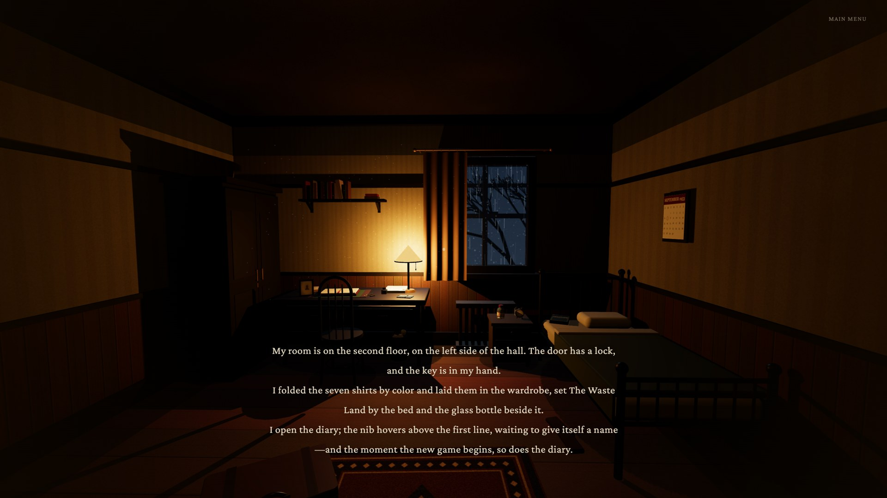
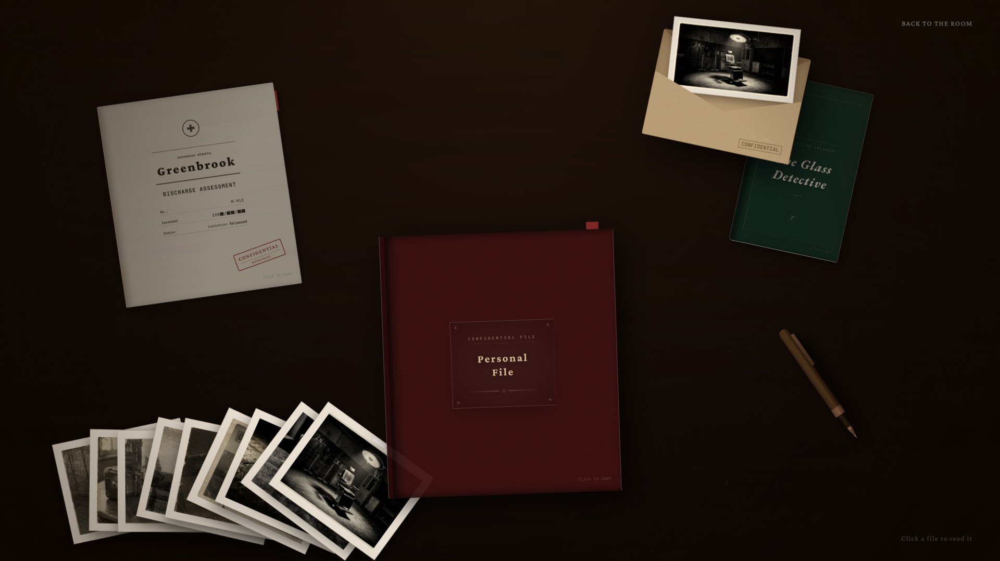
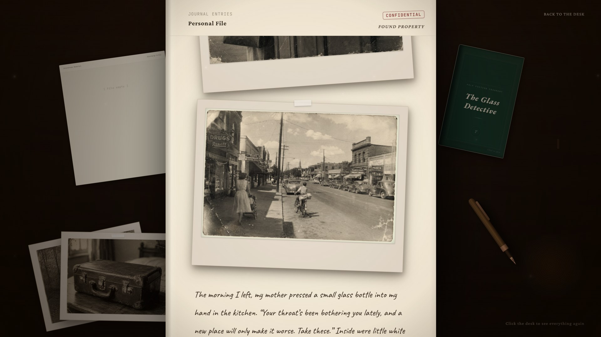
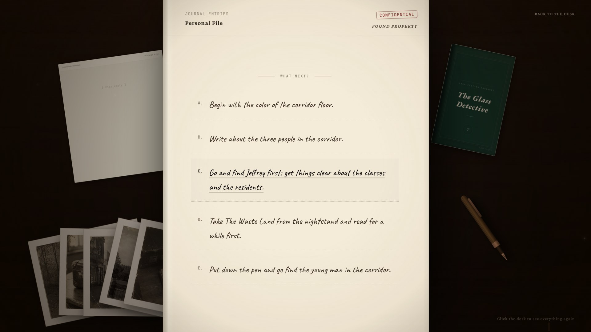
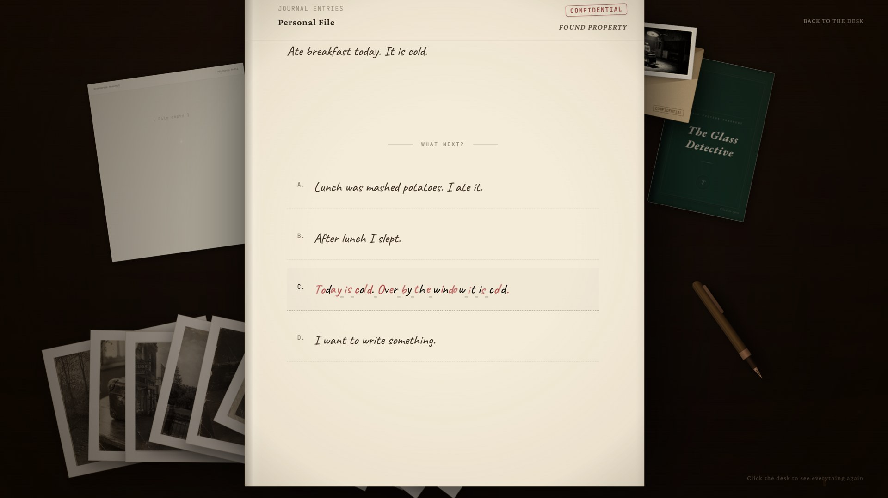
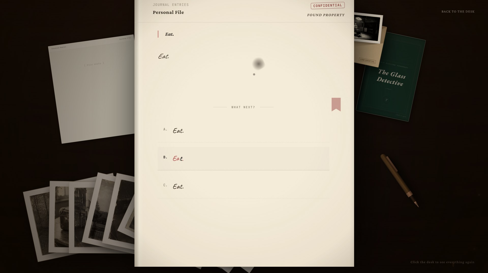

# The Greenbrook Institute

An interactive narrative of erasure. In September 1953, Edward Banks, a literature teacher, arrives at the Greenbrook Institute believing he has been hired as a resident teacher. Through his diary, and through the choices the player makes on his behalf, the language of a mind and the ability to choose wear away together.

English edition. Single player, about one hour. Runs in a web browser; no installation needed.



## Play

**Online:** https://AmberCloud17.github.io/greenbrook-institute/

**Offline:**

1. Click the green **Code** button on this page, then **Download ZIP**, and unzip it.
2. Double-click `index.html`. The game opens in your browser.

If the 3D room does not load or the mouse cannot look around after double-clicking, some browsers are restricting local files. Open a terminal in the unzipped folder and run:

```bash
python3 -m http.server 8000
```

then visit http://localhost:8000 in your browser.

A recent desktop version of Chrome, Edge, or Firefox is recommended. The game needs WebGL and works best with a mouse and keyboard.

## Controls

| Action | Key |
| --- | --- |
| Walk | `W` `A` `S` `D` or arrow keys |
| Look around | Move the mouse (click the screen first) |
| Interact | `E` or left click on a highlighted object |
| Release the mouse / pause | `Esc` |

Walk to the desk and open the diary to begin. Progress is saved automatically in your browser.

## Screenshots

| | |
| --- | --- |
|  |  |
|  |  |



## About

Written and designed by Xinran Xiong (School of Future Design, Beijing Normal University). The work accompanies the paper *When the Loop Closes: Co-Degradation as Expressive Content in an Interactive Narrative of Erasure*, ICIDS 2026.

The game depicts psychiatric institutionalisation and surgery in the 1950s.

Developer notes (in Chinese), including how to rebuild from `src/`, are in [README.zh-CN.md](README.zh-CN.md). Fonts are under the SIL Open Font License; see `fonts/`.
